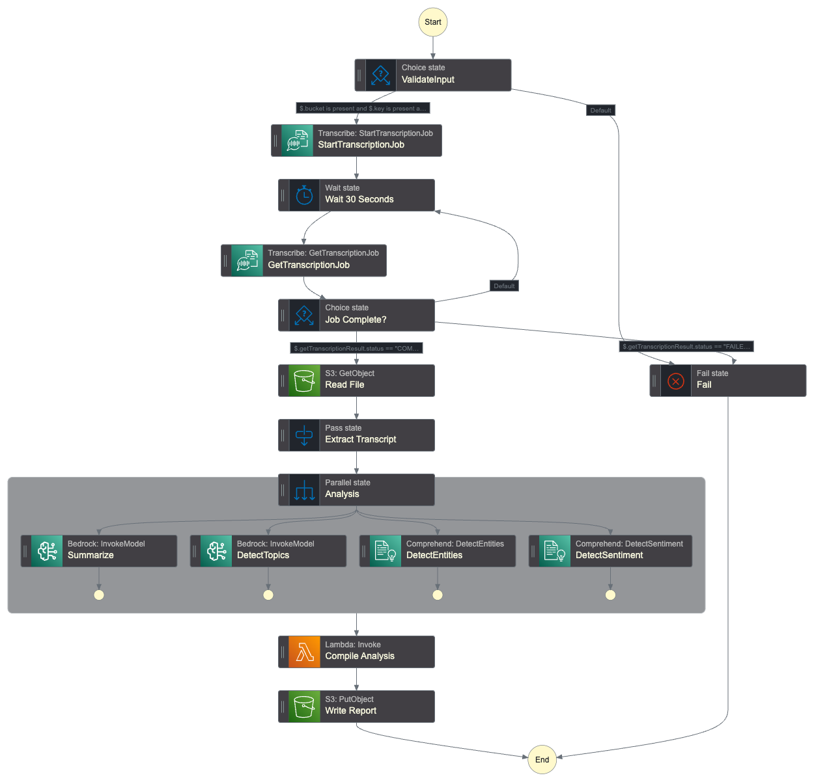

# Distiller

A serverless pipeline for processing and analyzing audio content using AWS
services.

## Architecture

The solution uses multiple AWS services orchestrated by Step Functions:

- Amazon S3 for storage
- Amazon Transcribe for speech-to-text
- Amazon Comprehend for NLP tasks
- Amazon Bedrock for AI-powered analysis
- AWS Lambda for processing
- AWS Step Functions for orchestration

## Components

- `lambdas/`: Lambda functions for processing
- `step_functions/`: Step Functions workflow definitions

## Getting Started

1. Deploy the Lambda functions
2. Create the Step Functions state machine
3. Configure IAM roles and permissions
4. Test the pipeline with sample audio

## Prerequisites

- AWS Account with appropriate permissions
- AWS CLI configured
- Rust toolchain (for Lambda development)
- Basic knowledge of AWS services

## Overview



## Usage

1. Upload an audio file to S3
2. Start the Step Functions execution with:

   ```json
   {
     "bucket": "your-bucket",
     "key": "audio-file.mp3",
     "languageCode": "en"
   }
   ```

3. Monitor the execution in AWS Console
4. Retrieve the analysis report from S3

## Development

See individual component READMEs for specific development instructions.
